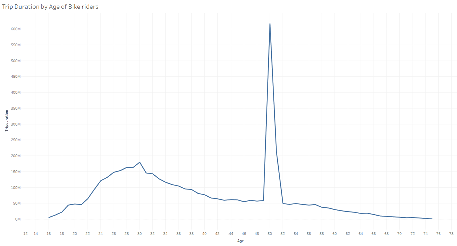

# Tableau-Challenge
New York Citi Bike Analytics
https://public.tableau.com/profile/cicily.george#!/vizhome/CityBikeAnalytics2019-2020/CityBikeAnalyticsStory

### Summary

* In 2020, Summer the bike rides were almost nil due to covid-19 restrictions. But Compared to 2019 Winter 2020 rides has increased. 

* Morning Peak hours are 8am and 9am.
* Evening Peak hours are 5pm and 6pm. 5pm has the most number of records for ride starts.
* In Winter, there is not much difference in Peak hours compared to that of Summer

* Riders aged 30 are riding more time and more number of times. Some anomaly in Riders with year of birth 1969 were ditected, more Gender unknown cases and trip Duration is high. It seems 1969 is set as default Birth year in case riders are not sharing their Birth year it is set to the default year. Those records with birth year 1969 and Gender unknown were eliminated from the study.

* The Top Starting Stations and Destination Stations are the same and they are located near to City's most Tourist Attractions

* Subscribers are more than Customers. Because Subscription plans are better. It is also evident that compared to Tourists, Local people are riding more.
